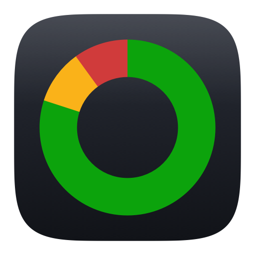
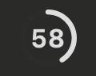
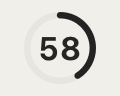
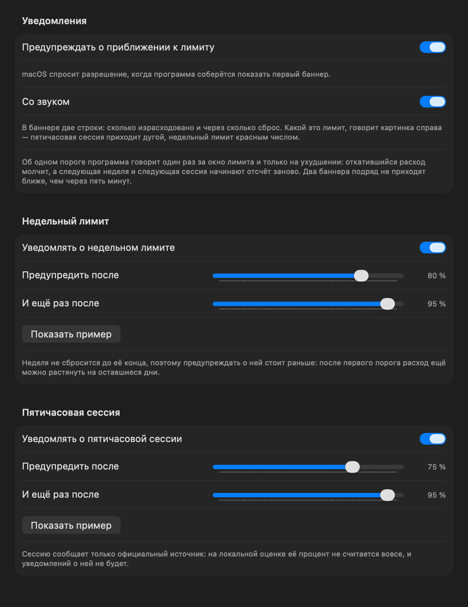
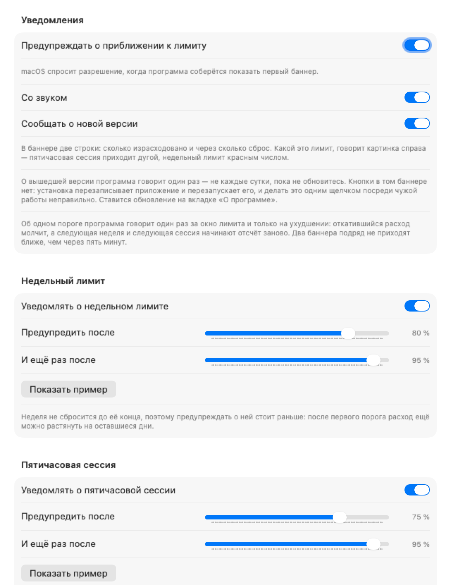

<p align="center">
  
</p>

# ClaudeWeek

[](https://github.com/Greem4/ClaudeWeek/actions/workflows/ci.yml)
[](https://github.com/Greem4/ClaudeWeek/releases/latest)
[](CHANGELOG.md)
[](#установка)
[](Package.swift)
[](LICENSE)

Меню-бар приложение для macOS: недельный лимит Claude Code одним взглядом.

На каждой полосе два цвета — **план** (сколько допустимо потратить к этому
моменту) и **факт** (сколько реально потрачено). Видно не только «сколько
осталось», но и «иду я в графике или обгоняю».

<p align="center">
  
  
</p>

Иконка в строке меню — кольцо с процентом внутри, всего ~28 pt ширины; в
настройках вместо него можно поставить полосу недели с процентом под ней.
Кольцо показывает оба лимита сразу: один заполняет дугу, второй стоит цифрой
в центре. Что где —
выбирается там же: по умолчанию дуга это пятичасовая сессия, а цифра неделя,
но их можно поменять местами.

Цвет у дуги и у цифры **свой** — каждый по своим порогам. Красная дуга при
спокойной цифре означает ровно то, что написано: пятичасовой лимит на исходе,
а недельный ещё нет. Это не рассинхрон, а два независимых лимита в одном
значке.

<p align="center">
  
  
  
  
</p>

---

## Установка

**Требования:** macOS 14+ и установленный, авторизованный Claude Code. Ни Apple
ID, ни платной подписки разработчика не нужно.

### Готовая сборка

Скачайте `.dmg` со [страницы релизов](https://github.com/Greem4/ClaudeWeek/releases/latest),
перетащите приложение в Applications и снимите карантин:

```bash
xattr -dr com.apple.quarantine /Applications/ClaudeWeek.app
```

Образ собран под Apple Silicon (M1 и новее) и подписан ad-hoc, без Apple
Developer ID, — потому Gatekeeper и просит подтверждения. Кто предпочитает не
верить чужому бинарю, собирает из исходников: там ровно те же три команды, что
выполняет CI.

На Intel готового образа нет — только сборка из исходников, разделом ниже. Она
там работает, но регулярно её никто не проверяет.

Дальше приложение следит за версией само: раз в сутки спрашивает GitHub, а
найдя новый выпуск, показывает строку внизу панели. Обновляется по кнопке в
настройках («О программе»): покажет, что изменилось, скачает образ, сверит его
SHA256 с суммой из релиза, заменит себя и спросит про перезапуск. Настройки и
калибровка остаются на месте. Подробности — в
[docs/USAGE.md](docs/USAGE.md#обновление); то же самое из терминала делает
`ClaudeWeek --update`.

Чем одна версия отличается от другой, записано в
[журнале изменений](CHANGELOG.md) — человеческими словами, а не списком
коммитов. Оттуда же собираются заметки к каждому релизу, так что читать его
можно и прямо на странице выпуска. В программе он открывается ссылкой рядом с
номером версии — «О программе».

### Из исходников

Нужны Command Line Tools (`xcode-select --install`); полный Xcode не требуется.

```bash
git clone https://github.com/Greem4/ClaudeWeek.git
cd ClaudeWeek
./scripts/install.sh   # соберёт, поставит в ~/Applications, включит автозапуск
```

Приложение появится в строке меню. Снять — `./scripts/uninstall.sh`.
Обновиться — тот же `install.sh`: он пересобирает бандл, гасит работающую
копию и удаляет прежнюю установку целиком (включая забытые launchd-агенты и
копию в `/Applications`), и только потом ставит новую. Вторая иконка в строке
меню не появится, настройки и калибровка останутся.

Скрипт печатает, что именно собирает — ветку, коммит и дату, — и умеет ставить
не только текущий каталог:

```bash
./scripts/install.sh --latest         # самую свежую ветку репозитория
./scripts/install.sh --ref my-branch  # конкретную ветку, тег или коммит
```

Ничего вводить не нужно: приложение читает OAuth-токен уже авторизованного
Claude Code из Keychain — только читает, наружу не отдаёт, на диск не пишет.
Разбор — [docs/USAGE.md](docs/USAGE.md#авторизация-и-доступ).

Один раз стоит сделать вот что:

```bash
./scripts/signing-cert.sh   # постоянный сертификат подписи
```

Без него macOS спрашивает доступ к записи Keychain с токеном после каждой
пересборки: разрешение привязано к подписи, а ad-hoc подпись — это хеш бинаря,
свой у каждой сборки. С сертификатом подпись перестаёт меняться, и приложение
остаётся в списке доверенных навсегда. Apple ID и Developer ID для этого не
нужны; Gatekeeper он не отменяет. Подробности —
[docs/USAGE.md](docs/USAGE.md#чтобы-разрешение-спросили-один-раз).

Одного сертификата, впрочем, мало: вторую проверку — partition list — Claude
Code сбрасывает каждым обновлением токена, и диалог возвращался раз в сутки.
Поэтому запись читается утилитой `/usr/bin/security`, которой тот же токен
пишет сам Claude Code: разрешение на неё он и восстанавливает. Разбор —
[docs/USAGE.md](docs/USAGE.md#почему-одного-сертификата-не-хватило).

---

## Что показывает

- **Неделя с планом** — семь суточных полос: факт, плановая зона, перерасход.
  100 % лимита раскладываются по **рабочим часам** (по умолчанию 11:00 → 00:00),
  а не по астрономическим: сон не должен весить столько же, сколько работа.
- **Пятичасовую сессию** — отдельной строкой над сутками, с часом сброса. Тот
  лимит, в который упираются чаще недельного.
- **Прогноз** — «при таком темпе кончится ПТ 15:57», тоже по рабочим часам.
- **Чем потрачено** — клик по цифрам процента заменяет дни разбивкой по
  моделям: доля Opus, Sonnet и Haiku теми же полосами; клик ещё раз возвращает
  неделю. Считается по вашим транскриптам: сервер сообщает только итог недели.
- **Откуда цифры** — кружок у полосы сессии: зелёный залитый — живой ответ
  сервера, жёлтый — кеш, красный контурный — локальная оценка. Форма дублирует
  цвет, чтобы читалось при дальтонизме.
- **Честный офлайн** — без сети расход считается по вашим же транскриптам
  `~/.claude/projects` и помечается знаком `≈`. Калибруется сам, по последнему
  официальному ответу.
- **Пороги цвета** — жёлтый после 81 %, красный после 93 % у недели и 95 % у
  сессии; считается по факту, а не по плану. Цвет значка можно и вовсе выключить —
  вкладка «Строка меню».
- **Уведомления по своим порогам** — баннер macOS, когда расход перешагнул
  заданную отметку: по два порога на недельный лимит (80 и 95 % из коробки) и на
  пятичасовую сессию (75 и 95 %). Каждый лимит выключается отдельно, все
  уведомления — общим тумблером. Подробнее ниже.
- **Пять палитр и компактный режим** — вкладка «Панель»; изменения видны сразу,
  на живой панели.
- **Русский и английский** — язык следует за системным, а на вкладке «Общие»
  выбирается явно: «Как в системе», «Русский» или «English». Переключается на
  ходу, без перезапуска.

Подробности по каждому пункту, все настройки, ключи конфига и флаги командной
строки — в [руководстве](docs/USAGE.md).

---

## Уведомления

Цвет значка замечают, только посмотрев на часы, — а баннер приходит сам.
Отметки, на которых стоит отвлечься, задаются на вкладке «Уведомления»: по два
порога на каждый лимит, свои для недели и для пятичасовой сессии.

<p align="center">
  
  <br>
  
</p>

В баннере две строки — сколько израсходовано и через сколько сброс, — а какой
это лимит, говорит **картинка**, а не третья строка текста: **недельный лимит
приходит числом, пятичасовая сессия — дугой**. Тот же язык, что в строке меню,
где дуга по умолчанию отдана сессии, а цифра в центре — неделе.

Цвет картинки считается по **вашим порогам уведомлений**: от первого до второго
жёлтый, от второго и выше — красный. Не по цветам значка: те стоят на своих
отметках (81 и 93 %), и баннер о пробитом пороге приходил бы со спокойным
зелёным числом просто потому, что до окраски значка не хватило процента.

Три правила держат баннеры нешумными:

- **один порог — один раз** за окно лимита: следующая неделя и следующая
  сессия начинают отсчёт заново;
- **только на ухудшении** — откатившийся расход молчит;
- **не чаще раза в пять минут**, даже когда оба лимита пробиты разом.

Сказанное запоминается в `~/.config/claude-week/alerts.json` и переживает
перезапуск: после перезагрузки посреди недели про пройденные пороги программа
молчит. Выключить можно всё разом или по лимиту в отдельности; разрешение macOS
спрашивается один раз, при первом запуске. Как баннер выглядит именно у вас,
показывает кнопка «Показать пример» — своя в каждой секции:

<p align="center">
  
  
</p>

---

## Сборка и проверки

```bash
swift build                  # обе цели
swift run ClaudeWeekTests    # 439 проверок: без сети, без UI, свой раннер
./scripts/make-app.sh        # dist/ClaudeWeek.app — бандл, ничего не устанавливая
ARCH=arm64 ./scripts/make-dmg.sh    # dist/ClaudeWeek-<версия>-arm64.dmg
```

То же самое гоняет [CI](.github/workflows/ci.yml) на каждый push и pull request —
и собирает строже, с `-warnings-as-errors`: предупреждение роняет сборку.
Релиз выходит сам при слиянии pull request в `main`:
[workflow](.github/workflows/release-on-merge.yml) поднимает версию в
`Version.swift`, ставит тег и запускает
[сборку](.github/workflows/release.yml) — она сверит тег с `Version.swift`,
прогонит проверки, соберёт образ под Apple Silicon и выложит его в Releases
вместе с контрольной суммой. Разряд версии выбирается меткой на PR
(`версия:минор`, `версия:мажор`, без метки — патч), метка `без-релиза` выпуск
отменяет; подробности — в [CONTRIBUTING.md](CONTRIBUTING.md#как-выходит-релиз).

Библиотека и два исполняемых таргета: `ClaudeWeekCore` — расчёты без единого
импорта UI, `ClaudeWeekApp` — строка меню, панель и настройки, `ClaudeWeekTests` —
свой тест-раннер (XCTest без Xcode недоступен). Разделение намеренное: окно
недели и план — самая ошибкоопасная часть, и её нужно гонять тестами без запуска
приложения. Карта кода, потоки данных и рецепты правок —
[docs/ARCHITECTURE.md](docs/ARCHITECTURE.md).

---

## Чем отличается от похожих

Счётчиков лимита Claude Code написано много —
[CCSeva](https://github.com/Iamshankhadeep/ccseva),
[ClaudeUsageBar](https://www.claudeusagebar.com/),
[cc-usage-bar](https://github.com/lionhylra/cc-usage-bar),
[cctray](https://github.com/goniszewski/cctray). Все показывают, **сколько
осталось**; разбор — в [ROADMAP](docs/ROADMAP.md#соседи-по-полке). Коротко:

- **плановая зона на полосе** — только здесь: не «сколько осталось», а «иду я в
  графике или обгоняю»;
- **ни Node, ни `ccusage`, ни запуска `claude` ради вывода `/usage`** — тот же
  ответ берётся одним GET, нативным кодом;
- **офлайн честный**: локальная оценка калибруется сама и помечается знаком `≈`,
  а не выдаётся за точную цифру;
- **палитра прогнана через валидатор** на дальтонизм и контраст.

## Чего не хватает

- **история не копится** — сравнить «эта неделя против прошлой» нельзя;
- **лимиты по моделям и докупленные кредиты не показываются**;
- **разбивки по проектам нет** — стоимость каждого считается, наружу выходит сумма;
- **уведомления о новой версии живут внутри программы** — панель, меню и
  настройки; системного всплывающего окна нет;
- **эндпоинт `/api/oauth/usage` не документирован публично** и может измениться
  без предупреждения; тогда виджет уйдёт на локальную оценку.

Полный список с приоритетами — [docs/ROADMAP.md](docs/ROADMAP.md).

---

## Документация

| Файл | О чём |
|---|---|
| [CHANGELOG.md](CHANGELOG.md) | журнал изменений: что нового в каждой версии, начиная с первой |
| [docs/USAGE.md](docs/USAGE.md) | руководство: доступ, панель, расчёт плана, все настройки и ключи конфига, командная строка |
| [docs/ARCHITECTURE.md](docs/ARCHITECTURE.md) | карта кода: кто за что отвечает, потоки данных, инварианты, рецепты правок |
| [docs/API.md](docs/API.md) | официальный источник: схема ответа, токен, дисциплина запросов |
| [docs/SPACES.md](docs/SPACES.md) | панель и рабочие столы: почему «не открывается по щелчку», измерения и пробы для разбора |
| [docs/PLAN.md](docs/PLAN.md) | план работ, модель данных, разбор рисков и отвергнутых вариантов |
| [docs/ROADMAP.md](docs/ROADMAP.md) | чего не хватает и что делать дальше |

## Автор и лицензия

Пишет и ведёт проект [Greem4](https://github.com/Greem4) — он же единственный
контрибьютор. Правки со стороны принимаются через issue и pull request:
[CONTRIBUTING.md](CONTRIBUTING.md).

[MIT](LICENSE). Программа не связана с Anthropic и никак ею не поддерживается.
