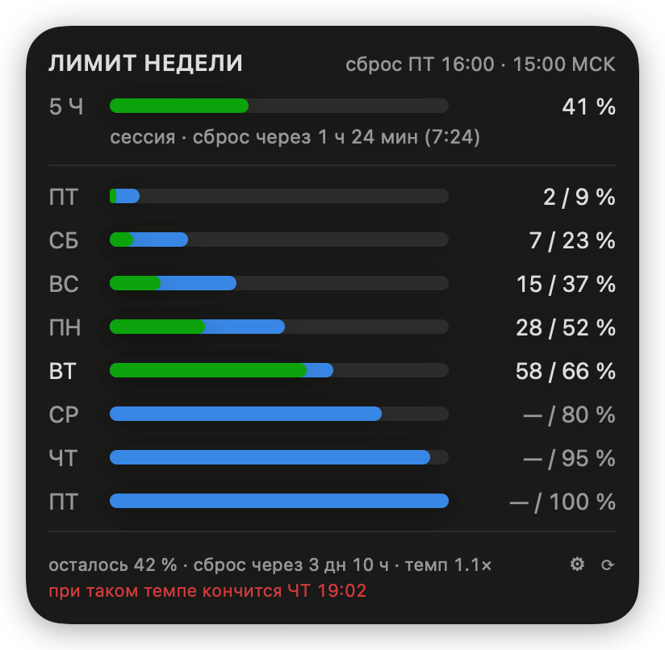
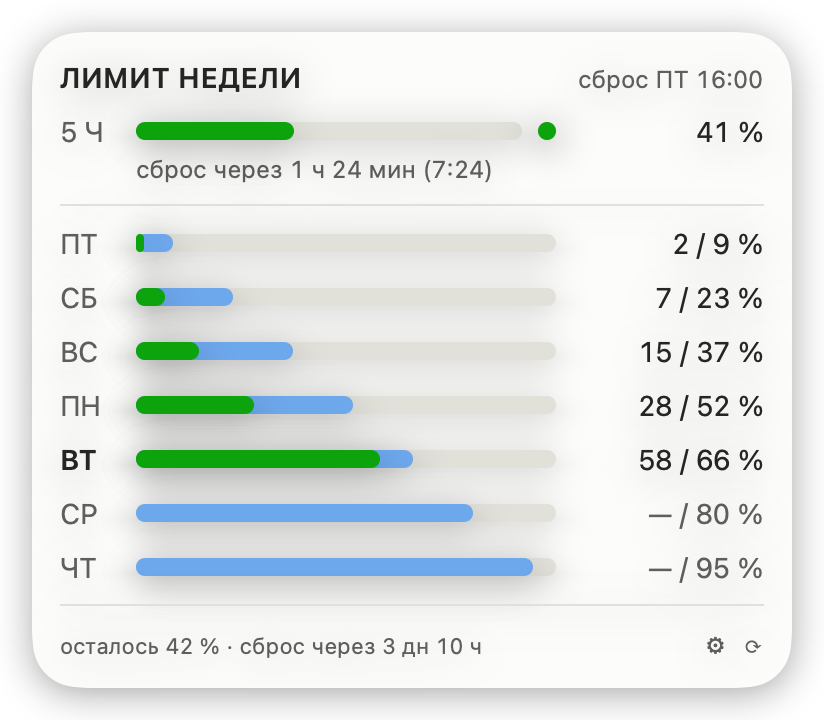
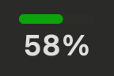
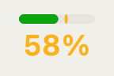

# ClaudeWeek

Меню-бар приложение для macOS: недельный лимит Claude Code одним взглядом.

На каждой полосе два цвета — **план** (сколько допустимо потратить к этому
моменту) и **факт** (сколько реально потрачено). Видно не только «сколько
осталось», но и «иду я в графике или обгоняю».

<p align="center">
  
  
</p>

Иконка в строке меню — полоса недели и процент под ней, всего ~28 pt ширины:

<p align="center">
  
  
</p>

Строки суток — **календарные**: они меняются в местную полночь, а не в час
сброса. Само окно недели границам суток не подчиняется и начинается там, где
его открыл сервер: в 12:00 UTC пятницы — это 15:00 по Москве и 16:00 в UTC+4.
Поэтому крайние строки короче остальных: первая — вечер пятницы после сброса,
последняя — её же утро перед следующим. Обе подписаны «ПТ», а какие именно
часы за ними стоят, показывает подсказка при наведении.

Первой строкой — **пятичасовая сессия**: тот лимит, в который упираются
чаще, чем в недельный. Она стоит над разделителем, в одной сетке с сутками,
но по свою его сторону: это независимый лимит, а не восьмой день недели.
Плановой зоны у неё нет намеренно — пятичасовое окно не обязано расходоваться
равномерно, и синяя «сколько положено к этому часу» изображала бы темп,
которого у сессии по смыслу нет.

---

## Оглавление

- [Установка](#установка)
- [Как это выглядит](#как-это-выглядит) — панель, темы, строка меню
- [Настройки](#настройки) — окно настроек и файл конфигурации
- [Откуда берутся цифры](#откуда-берутся-цифры) — официальный и локальный источники
- [Командная строка](#командная-строка)
- [Устройство](#устройство) — куда лезть, если что-то менять
- [Чего не хватает](#чего-не-хватает) — честный список пробелов
- [Чем отличается от похожих](#чем-отличается-от-похожих)
- [Документация](#документация)

---

## Установка

```bash
./Scripts/install-agent.sh   # собирает, ставит в ~/Applications, включает автозапуск
```

Приложение появится в строке меню. Снять — `./Scripts/uninstall-agent.sh`.

Обновиться — тот же `./Scripts/install-agent.sh`: он пересобирает бандл, гасит
работающую копию и удаляет прежнюю установку, и только потом ставит новую.
Вторая иконка в строке меню не появится. Собрать бандл, ничего не ставя, —
`./Scripts/make-app.sh` (кладёт `dist/ClaudeWeek.app`).

**Требования:** macOS 14+, Command Line Tools (`xcode-select --install`; полный
Xcode не нужен), установленный и авторизованный Claude Code. Ни Apple ID, ни
платной подписки разработчика не требуется.

### Авторизация и доступ

Ничего вводить не нужно: приложение берёт OAuth-токен уже авторизованного
Claude Code из Keychain (запись `Claude Code-credentials`) и потому видит ровно
тот аккаунт, что показывает `/usage`. Ни API-ключа, ни отдельного входа,
ни строки в конфиге — токену не место в файле на диске.

Что происходит с этой записью:

- **только чтение.** Токен обновляет сам Claude Code; ClaudeWeek в неё не
  пишет никогда — два процесса, наперегонки правящие одну запись, теряют токен.
- **разрешение спрашивает macOS.** При первом запуске всплывает системный
  диалог доступа к записи, и его можно отклонить. После пересборки он
  появляется снова: разрешение привязано к подписи бинаря, а ad-hoc подпись
  меняется при каждой сборке.
- **токен никуда не уходит.** Не пишется на диск, не попадает в лог, не
  показывается в интерфейсе. Единственный сетевой адресат — `api.anthropic.com`;
  в кеш ложатся проценты, границы окна и метка времени.
- **всё это проверяется глазами** — `Keychain.swift` и `OfficialProvider.swift`,
  и собираете вы из исходников сами.

**Вставить свой токен нельзя.** Эндпоинт `/api/oauth/usage` принимает только
токен сеанса Claude Code: проверено 2026-08-05 — годовой токен от
`claude setup-token` он отвергает с `401 Invalid bearer token`, API-ключ
(`sk-ant-api…`) тоже. Своего окна авторизации у ClaudeWeek нет и не будет:
`client_id` сторонним программам Anthropic не выдаёт, а ходить с чужим значило
бы показывать человеку в окне согласия чужое имя. Подробности — в
[docs/API.md](docs/API.md#токен).

**Можно и вовсе без токена.** `provider: local` (в настройках — «Только
локальная оценка») к Keychain не обращается совсем: расход считается по вашим же
транскриптам в `~/.claude/projects`. Цена отказа — знак `≈` перед процентом.

### Калибровка — сама

Руками ничего подбирать не нужно. На каждом успешном официальном ответе
приложение сверяет с ним локальный расчёт и запоминает, сколько условных
долларов приходится на 100 % лимита. Когда сеть пропадёт, офлайн-оценка
опирается на этот эталон и на настоящий момент сброса — а не на догадку из
конфига. Проверено: 52 % официальных и 52 % офлайн-оценки на тех же данных.

Подобранный бюджет лежит в `~/.config/claude-week/cache.json`; ваш `config.json`
приложение перезаписывает только когда вы сами меняете что-то в окне настроек.

Ручная калибровка осталась на случай, когда официального ответа не было ни
разу, — выполните `/usage` внутри Claude Code и передайте число:

```bash
~/Applications/ClaudeWeek.app/Contents/MacOS/ClaudeWeek --calibrate=64
```

Заданный так `weeklyBudget` в конфиге всегда важнее подобранного: его выбрал
человек.

---

## Как это выглядит

Панель открывается по левому клику: без стрелки-хвостика, верхней кромкой
вплотную к строке меню, на материале системного меню — то есть полупрозрачная,
с размытием того, что под ней. Появляется мгновенно, закрывается кликом мимо
или по Esc. Правый клик по иконке даёт обычное меню: «Обновить», «Настройки…»,
«О программе», «Выйти».

Условные обозначения на полосе:

```
█ факт   ▓ перерасход   ▒ остаток плана   ░ вне плана
```

Текущие сутки подписаны полужирным — сутки считаются по зоне окна, той же, по
которой строится весь ряд. Одного цвета подписи на это не хватало: в ряду из
семи одинаковых сокращений сегодняшний день приходилось искать.

### Вся неделя или только сегодня

По умолчанию панель показывает весь ряд. В настройках, вкладка **Внешний
вид**, его можно свернуть до текущих суток: остаются пятичасовая сессия и одна
дневная полоса, а заголовок с часом сброса и футер с итогом недели — на месте.
Панель выходит короче на шесть строк.

Неделя при этом не потеряна: **щёлкните по строке дня, и ряд раскроется
целиком** — до повторного клика или до закрытия панели. Следующий её показ
снова компактный: раскрытие — то, что вы делаете сейчас, а не настройка.

### Сколько можно тратить

План раскладывает 100 % недельного лимита **по рабочим часам**, а не по
астрономическим. Рабочий день задаётся в настройках (по умолчанию 11:00 →
00:00); ночью линия плана стоит. Отсюда простое правило: **факт ниже плана —
идёте в графике, выше — сгорите раньше пятницы.**

Ряд для рабочего дня 11:00 → 00:00 и окна «ПТ 16:00 → ПТ 16:00» (московское
время — на час меньше). Всего в неделе 91 рабочий час:

| Строка | Часы в окне | Рабочих часов | Бюджет строки | План к её концу |
|---|---|---|---|---|
| ПТ (вечер) | 16:00 → 0:00 | 8 | 8,8 % | 8,8 % |
| СБ | сутки | 13 | 14,3 % | 23,1 % |
| ВС | сутки | 13 | 14,3 % | 37,4 % |
| ПН | сутки | 13 | 14,3 % | 51,6 % |
| ВТ | сутки | 13 | 14,3 % | 65,9 % |
| СР | сутки | 13 | 14,3 % | 80,2 % |
| ЧТ | сутки | 13 | 14,3 % | 94,5 % |
| ПТ (утро) | 0:00 → 16:00 | 5 | 5,5 % | 100 % |

Строк на панели при этом семь, а не восемь: **пятница занимает одну**. Сброс
режет её надвое, но это один день недели, и двумя строками с несопоставимыми
процентами он только путал. Показывается та половина, которая идёт сейчас:

- **пока неделя катится** — вечер пятницы после сброса: первая строка, 8,8 %;
- **с полуночи последних суток окна** — её утро перед следующим сбросом:
  строка уходит в конец ряда, за четверг с его 94,5 %, и доводит неделю до
  100 %;
- **в 16:00 (15:00 МСК) лимит сбрасывается**, окно становится новым, и пятница
  снова первая строка — уже с новыми 8,8 % на вечер.

Что из этого следует на практике:

- **98 % в пятницу к 14:00 — это ровно по плану**, а не перерасход: до сброса
  остаётся один рабочий час из 91. Остаток догорит сам.
- **Вечер пятницы после сброса — полноценные 8,8 %**, потому что все восемь
  часов до полуночи рабочие. Это больше, чем достаётся утру пятницы (5,5 %):
  там до сброса всего пять рабочих часов, с 11:00 до 16:00.
- **Полные сутки весят одинаково — 14,3 %**, сколько бы часов вы ни спали.
  Именно это и ломалось, пока план шёл по астрономическому времени: сон
  забирал около 40 % недельного бюджета и раздувал те строки, куда попадала
  ночь.
- **Утром вы начинаете там же, где закончили вечером.** Ночь линию не двигает,
  так что вечернее отставание за сон не отыгрывается — и вечерний перерасход
  за ночь не рассасывается тоже.
- **Работа в три ночи целиком идёт в перерасход.** Плана на этот час нет.
  Если так выходит регулярно — раздвиньте рабочий день в настройках.
- **Перерасход виден по расхождению полос**, а когда он ведёт к беде — второй
  строкой футера: «при таком темпе кончится ПТ 15:57». Момент ищется тоже по
  рабочим часам: обещать исчерпание в четыре утра, когда никто не работает,
  бессмысленно.

Пятичасовая сессия к этому расчёту отношения не имеет: она сбрасывается своим
чередом, и упереться в неё можно на любой неделе, даже нетронутой.

### Темы

Палитра выбирается в настройках, вкладка **Внешний вид**. Роли цветов везде
одни и те же — меняются оттенки:

| Системная | Полночь | Графит |
|---|---|---|
|  |  |  |

| Бумага | Контраст | Светлая тема системы |
|---|---|---|
|  |  |  |

**Системная** — родная палитра: она прогнана через валидатор на разделимость
при дальтонизме и контраст к фону, и менять её цвета по вкусу нельзя (§5.2
плана). Остальные — игровая площадка: роли цветов те же, но валидатором они не
проверялись.

Все картинки в этом README рисует сама программа:
`ClaudeWeek --screenshot docs/images` — панель во всех темах и обоих системных
оформлениях плюс иконка строки меню.

---

## Настройки

Окно открывается кнопкой ⚙ в панели или правым кликом по иконке →
«Настройки…». Изменения применяются сразу — «Сохранить» там нет: пока крутите
ползунок прозрачности, панель перерисовывается вместе с ним. Всё, что
меняется в окне, ложится в `~/.config/claude-week/config.json`, и наоборот —
правки файла руками подхватываются в течение минуты.

Пока окно открыто, панель закреплена у строки меню: она не закрывается по
клику мимо и служит предпросмотром — с настоящим размытием, своими цифрами и в
своём размере. Окно настроек при первом открытии встаёт так, чтобы её не
накрыть. Уходите в другую программу — панель прячется вместе с приложением и
возвращается, когда вернётесь; закрыли окно настроек — панель снова ведёт себя
как обычно.

### Общие

| Настройка | Что делает |
|---|---|
| Источник данных | `auto` — официальный с падением на локальный, `official` — только сервер, `local` — только оценка по транскриптам |
| Обновлять раз в | интервал опроса, 1–30 минут (в сеть — не чаще раза в 60 с) |
| День / час / минута сброса | запасное недельное окно; при живом официальном источнике не используется — момент сброса приходит с сервера |
| Таймзона | в какой зоне считать границы суток |
| Рабочий день | распорядок из списка («Рабочий день 10–18», «Длинный день 10–22», «Вечерний 11–24», «С утра до ночи 9–22», «Круглосуточно») или свои часы степперами; по ним раскладывается недельный лимит, ночью план стоит. Строка «Получается» показывает выбранное словами: «11:00 – полуночи, 13 ч в сутки» |
| Пороги | во сколько раз факт может обгонять план, прежде чем пожелтеет **цифра в строке меню**, и после какой доли лимита тревожатся заголовок панели и полоса сессии |

Суточные полосы желтеют на любом перерасходе и порогам не подчиняются: это
сам график, а не тревога. Пороги красят цифру в строке меню (`warn`), заголовок
панели и полосу пятичасовой сессии (`critical`).

### Внешний вид

| Настройка | Что делает |
|---|---|
| Палитра | системная, полночь, графит, бумага, контраст |
| Прозрачный фон | материал системного меню с размытием либо сплошная заливка палитры |
| Плотность фона | 0 — чистый материал, как у системных меню; 1 — плотная вуаль, сквозь которую размытие ещё видно |
| Скругление углов | 0–24 pt |
| Суточные полосы | «Вся неделя» — семь строк; «Только сегодня» — одна, а неделя раскрывается кликом по ней, пока панель открыта |
| Строка сессии | показывать ли пятичасовой лимит |
| Прогноз | вторая строка футера «при таком темпе кончится …» |
| Строка меню | полоса с процентом, только полоса или кольцо с процентом внутри |
| Сброс сессии | «через 1 ч 12 мин», «в 14:35» или и то, и другое |

Отдельного предпросмотра на вкладке нет: всё это видно на самой панели, пока
открыто окно настроек. Исключение — подпись сброса сессии: без данных от
сервера строки сессии в панели нет вовсе, поэтому рядом с переключателем
стоит образец.

Сам момент сброса настройкой не двигается: его сообщает сервер вместе с
процентом, а выбирается только то, каким концом его показать. Час, попавший
на следующие сутки, подписывается днём недели — «в СР 2:15».

### Доступ

Настроек здесь нет — только объяснение, откуда берётся токен, почему вставить
свой нельзя и как обойтись без него вовсе, плюс кнопка «Проверить сейчас»: она
делает один настоящий запрос и печатает результат — процент или причину отказа.

### О программе

Версия, бюджет недели (с пометкой, задан он вами или подобран программой),
ручная калибровка, пути к конфигу, кешу и логу с кнопками «Открыть», а также
«Сбросить настройки» — с подтверждением, и сброс не трогает подобранный бюджет
и калибровку: их программа набрала по живым данным.

### Файл конфигурации

`~/.config/claude-week/config.json` — читается при старте и после правки
(проверка раз в минуту по отпечатку файла):

| Ключ | По умолчанию | Смысл |
|---|---|---|
| `resetWeekday` / `resetHour` / `resetMinute` | `6` / `16` / `0` | запасной момент сброса — пятница 16:00 в `timeZone` ниже, то есть 15:00 МСК; при живом официальном источнике не используется |
| `timeZone` | `Europe/Saratov` | таймзона окна и границ суток; пустая строка — системная. Сменили её — поправьте и `resetHour` |
| `refreshInterval` | `300` | секунды между обновлениями, минимум 30 |
| `provider` | `auto` | `official`, `local` или `auto` |
| `workHours.start` / `.end` | `11` / `24` | рабочий день, по которому раскладывается лимит; `24` — полночь. `0`/`24` — считать круглосуточно, как раньше |
| `menuBarStyle` | `percent` | `percent`, `compact` (только полоска) или `ring` (кольцо с процентом) |
| `weeklyBudget` | `0` | условная стоимость недели для офлайн-оценки; ставится калибровкой |
| `thresholds.warn` / `.critical` | `1.0` / `0.9` | когда желтеет цифра в строке меню и когда тревожатся заголовок и сессия |
| `appearance.theme` | `system` | `system`, `midnight`, `graphite`, `paper`, `contrast` |
| `appearance.transparentPanel` | `true` | материал с размытием или сплошной фон |
| `appearance.panelTintOpacity` | `0.18` | плотность вуали поверх материала, 0…1 |
| `appearance.cornerRadius` | `12` | скругление углов панели, pt |
| `appearance.panelLayout` | `week` | `week` — семь суточных полос, `compact` — только текущие сутки (неделя раскрывается кликом по строке дня) |
| `appearance.showSession` / `.showForecast` | `true` / `true` | показывать строку сессии и прогноз |
| `appearance.sessionReset` | `relative` | подпись сброса сессии: `relative` («через 1 ч 12 мин»), `absolute` («в 14:35») или `both` |

Незнакомые и пропущенные ключи не ломают запуск: недостающее берётся из
дефолтов, а недопустимые значения чинятся с предупреждением в лог. Ключи от
прошлых версий (например, `planAnchor` — настройка «План считать на», или
`appearance.showSessionLabel` — слово «сессия» в подписи, которых больше нет)
просто игнорируются.

---

## Откуда берутся цифры

- **Официальный источник** — тот же процент, что в `/usage`: `GET
  /api/oauth/usage` с токеном из Keychain. Момент сброса недели тоже берётся
  из ответа, а не из конфига. Схема и дисциплина запросов — в
  [docs/API.md](docs/API.md).
- **Локальный источник** — запасной, работает офлайн: расход считается по
  `~/.claude/projects/**/*.jsonl`, токены взвешиваются по ценам моделей, записи
  из `subagents/` дедуплицируются по `uuid`, файлы читаются инкрементально
  (полный проход 193 файлов — 1.3 с, повторный — 0.04 с). Калибруется сам по
  официальному ответу, так что переход на него не роняет точность.

### Точное и приблизительное

Официальный ответ содержит одно число на всю неделю — разбивки по суткам в нём
нет. Поэтому итог сверху точный, а форму полос приложение восстанавливает по
локальным транскриптам и масштабирует к официальному числу.

Откуда взяты цифры, говорит **кружок рядом с полосой сессии** — а когда строки
сессии нет, он переезжает в заголовок, к часу сброса:

| Кружок | Подпись | Что значит |
|---|---|---|
| зелёный, залитый | данные online | свежий ответ сервера — то же число, что в `/usage` |
| жёлтый, залитый | данные offline | цифры сервера, но из кеша: сеть или авторизация отвалились |
| красный, контурный | данные offline | локальная оценка по транскриптам |
| красный, контурный | данные недоступны | показывать нечего — отказ без кеша |
| серый, контурный | данные загружаются | первый запуск, ответ ещё в пути |

Форма дублирует цвет намеренно: зелёный с красным при дейтеранопии почти
сливаются, а «залито или пусто» видно всегда. Наведите на кружок — и панель
скажет то же словами, тем же цветом. Больше в подписи ничего нет: почему
именно сервер не ответил — строчка лога, а не панели.

Ждать подсказку не обязательно: **нажмите на кружок**, и тот же текст встанет
прямо в панели — на месте полосы сессии, а когда кружок в заголовке, на месте
часа сброса. Через несколько секунд строка вернётся к обычному виду; повторное
нажатие убирает текст сразу.

Когда официальный источник недоступен — нет сети, не авторизован Claude Code —
приложение молча переходит на локальную оценку и помечает цифру в строке меню
как приблизительную: `≈64%`.

### Свежесть

Данные бывают старыми, и кружок об этом говорит: если снимку больше двух минут,
он желтеет и подписывается «данные offline». Пожелтеть ему есть от чего — после
отказа сервера виджет держит паузу (1 → 2 → 4 → 8 → 15 минут) и всё это время
показывает последнее удачное число.

Держит, но не бесконечно: через 15 минут после последнего удачного ответа
старое число отбрасывается, и в режиме `auto` панель уходит на локальную оценку.
Оценка по сегодняшним транскриптам честнее позавчерашнего официального числа,
выданного за сегодняшнее.

### Что ещё умеет

- **Пятичасовая сессия** — отдельная полоса над сутками с часом сброса. Число
  официальное; локально оно не считается, поэтому офлайн показывается последнее
  известное — и только пока его пятичасовое окно не истекло. После сброса
  строка исчезает: показать вчерашние 95 % как сегодняшние хуже, чем не
  показать ничего.
- **Жизненный цикл** — обновление по таймеру, пауза на время сна, реакция на
  пробуждение и смену таймзоны, перечитывание конфига после правки.
- **Автозапуск** — LaunchAgent, приложение живёт только в строке меню
  (`LSUIElement`), без иконки в Dock.
- **Доступность** — разметка для VoiceOver (вживую ещё не прослушана),
  уважение к «Уменьшению движения», числа рядом с каждой полосой: цвет нигде
  не остаётся единственным носителем смысла.

---

## Командная строка

```
ClaudeWeek                 запустить приложение в строке меню
ClaudeWeek --json          состояние в JSON (дни, сессия, стоимость, темп)
ClaudeWeek --calibrate=N   подогнать оценку под официальные N %
ClaudeWeek --screenshot К  отрисовать панель во всех темах и иконку в PNG
ClaudeWeek --config=ПУТЬ   свой файл конфигурации
ClaudeWeek --provider=X    источник данных: official, local или auto
ClaudeWeek --icon К        сгенерировать .iconset (вызывается из make-app.sh)
ClaudeWeek --verbose       подробный лог в stderr
```

Незнакомый флаг, неизвестный источник у `--provider=` или не-число у
`--calibrate=` — это ошибка с кодом 2 и подсказкой, а не молчаливый запуск
иконки в строке меню.

---

## Устройство

Библиотека и два исполняемых таргета: `ClaudeWeekCore` — расчёты без единого
импорта UI, `ClaudeWeekApp` — строка меню, панель и настройки, `ClaudeWeekTests` —
свой тест-раннер. Разделение намеренное: окно недели и план — самая
ошибкоопасная часть (таймзоны, переходы через сброс, DST), и её нужно гонять
тестами без запуска приложения.

| Что менять | Куда лезть |
|---|---|
| цвета, темы, метрики панели | `Sources/ClaudeWeekApp/Theme.swift` |
| вёрстка панели | `PopoverView.swift`, `DayBar.swift`, `SessionRow.swift` |
| окно панели: форма, материал, поведение | `DropdownPanel.swift` |
| окно настроек | `SettingsView.swift`, `SettingsWindow.swift` |
| иконка строки меню | `MenuBarBar.swift`, `MenuBarRing.swift` |
| таймеры, системные события, склейка всего | `StatusItemController.swift` |
| новые настройки | `Sources/ClaudeWeekCore/Config.swift` + вкладка в `SettingsView.swift` |
| разбор ответа сервера | `Sources/ClaudeWeekCore/OfficialProvider.swift` |
| расчёт по транскриптам | `LocalProvider.swift` |
| окно недели, план, проценты | `WeekWindow.swift`, `Snapshot.swift` |
| рабочий день, по которому идёт план | `WorkHours.swift` |

Подробная карта с потоками данных, инвариантами и рецептами («как добавить
тему», «как добавить настройку», «как добавить источник») —
[docs/ARCHITECTURE.md](docs/ARCHITECTURE.md).

Проверки:

```bash
swift run ClaudeWeekTests      # 307 проверок, без сети и без UI
swift build                    # сборка обоих таргетов, без предупреждений
```

---

## Чего не хватает

Честный список того, чего в приложении нет. Подробности и приоритеты —
[docs/ROADMAP.md](docs/ROADMAP.md).

- **Уведомлений нет.** О перерасходе сообщает только цвет — если панель не
  открывать, о приближении к лимиту вы не узнаете. Есть у всех похожих
  программ и стоит первым в очереди.
- **История не копится.** Прошлые недели нигде не хранятся: сравнить «эта
  неделя против прошлой» пока нельзя.
- **Лимиты по моделям и докупленные кредиты не показываются** — в ответе
  сервера есть `seven_day_opus`, `seven_day_sonnet`, `extra_usage`, но на
  проверявшемся тарифе они приходили пустыми, и разбор не написан.
- **Разбивки по проектам нет** — стоимость каждого считается, наружу выходит
  только сумма.
- **VoiceOver не прослушан вживую.** Разметка есть, проверка ушами — нет.
- **Пятичасовая сессия офлайн не считается** — показывается последнее
  официальное значение, и то пока не истекло её окно.
- **Автозапуск ставится скриптом**, а не переключателем в настройках.
- **Автообновления нет** — новая версия ставится тем же `install-agent.sh`.
- **Эндпоинт `/api/oauth/usage` не документирован публично** и может
  измениться без предупреждения; тогда виджет уйдёт на локальную оценку.
- **Тесты не покрывают UI и окно настроек**: XCTest без Xcode недоступен,
  проверки написаны своим раннером и охватывают ядро.
- **Только по-русски**, и ни лицензии, ни CI в репозитории пока нет.

---

## Чем отличается от похожих

Счётчиков лимита Claude Code написано много —
[CCSeva](https://github.com/Iamshankhadeep/ccseva),
[ClaudeUsageBar](https://www.claudeusagebar.com/),
[cc-usage-bar](https://github.com/lionhylra/cc-usage-bar),
[cctray](https://github.com/goniszewski/cctray). Все показывают, **сколько
осталось**. Разбор — в [ROADMAP](docs/ROADMAP.md#соседи-по-полке); коротко:

- **Плановая зона на полосе** — только здесь. Остальные отвечают «сколько
  осталось», этот — ещё и «иду я в графике или обгоняю».
- **Ни Node, ни `ccusage`, ни запуска `claude` ради вывода `/usage`** — тот же
  ответ берётся одним GET, нативным кодом.
- **Офлайн честный**: локальная оценка калибруется по официальному проценту
  сама и помечается знаком `≈`, а не выдаётся за точную цифру.
- **Календарное недельное окно** с переводом часов и своей таймзоной.
- **Палитра прогнана через валидатор** на дальтонизм и контраст, и цвет нигде
  не единственный носитель смысла.

Чего у соседей есть, а здесь пока нет — уведомления, история, лимиты по
моделям, разбивка по проектам: см. [«Чего не хватает»](#чего-не-хватает).

---

## Документация

| Файл | О чём |
|---|---|
| [docs/ARCHITECTURE.md](docs/ARCHITECTURE.md) | карта кода: кто за что отвечает, потоки данных, инварианты, рецепты правок |
| [docs/API.md](docs/API.md) | официальный источник: схема ответа, токен, дисциплина запросов |
| [docs/PLAN.md](docs/PLAN.md) | план работ, модель данных, разбор рисков и отвергнутых вариантов |
| [docs/ROADMAP.md](docs/ROADMAP.md) | чего не хватает и что делать дальше |

### Принятые решения

Момент сброса берётся из официального ответа (`resets_at`), а не из конфига:
сервер знает его точно, а `resetWeekday`/`resetHour` — всего лишь догадка,
которая нужна офлайн. План строки — накопительный, на конец её суток: факт
в строке тоже накопительный, и сравнивать его с планом на середину значило бы
всю неделю показывать перерасход там, где его нет.

План идёт по рабочим часам, а не по астрономическим. Круглосуточная линия
была первой и продержалась ровно до первого взгляда на края окна: вечеру
пятницы после сброса (8 часов, все рабочие) она давала 4,8 %, а её утру
(16 часов, из которых 11 — сон) вдвое больше. Никакая подпись этого не
объясняет — сон просто не должен весить столько же, сколько работа. Цена
решения названа в настройках прямым текстом: ночью план стоит, и работа в
три ночи целиком ложится в перерасход.

Строки панели — календарные сутки местной зоны, а не «сутки окна» от сброса до
сброса. Первый вариант был вторым: он давал ровно семь строк с ровным рядом
7/21/36/50/64/79/93, но подписывал днём недели интервал, который на две трети
состоял из следующего дня, — в среду до 16:00 подсвечивалась строка «ВТ».
Календарные сутки стоят одной лишней строки (сброс делит пятницу надвое) и
неровного ряда, зато строка «СР» горит в среду. Проценты в неровном ряду
считаются временем, а не номером строки, поэтому неполные сутки получают свою
долю честно, а ряд приходит ровно к 100 % в момент сброса.

Форма подачи — выпадающая панель из строки меню, как у Stats или iStat Menus.
Виджет Центра уведомлений рассматривался и отклонён: он требует App Groups, а та
доступна только по платной подписке Apple Developer Program, которую из РФ штатно
не оплатить. Разбор — в [приложении Б плана](docs/PLAN.md).
