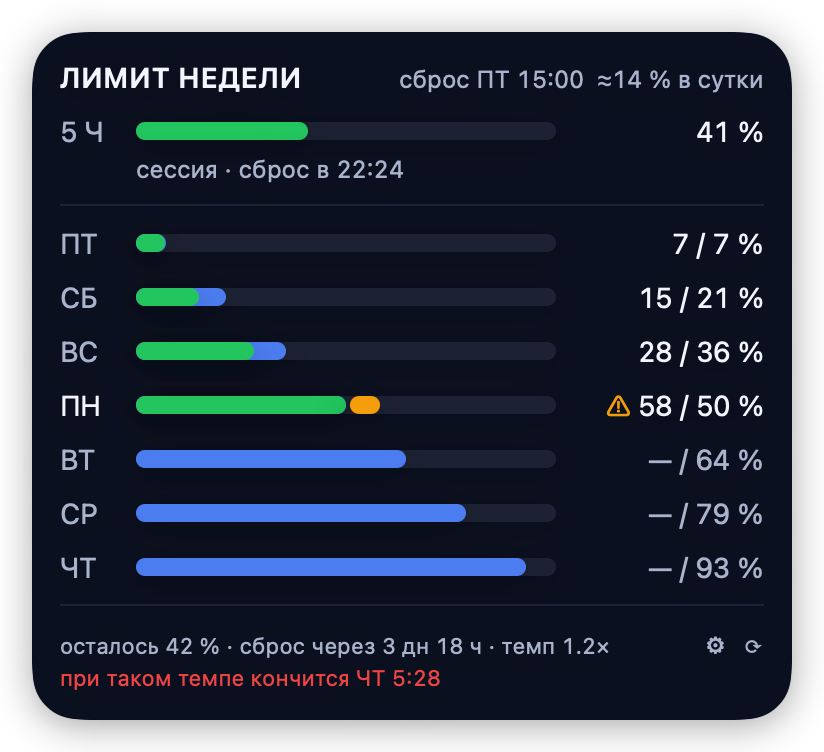
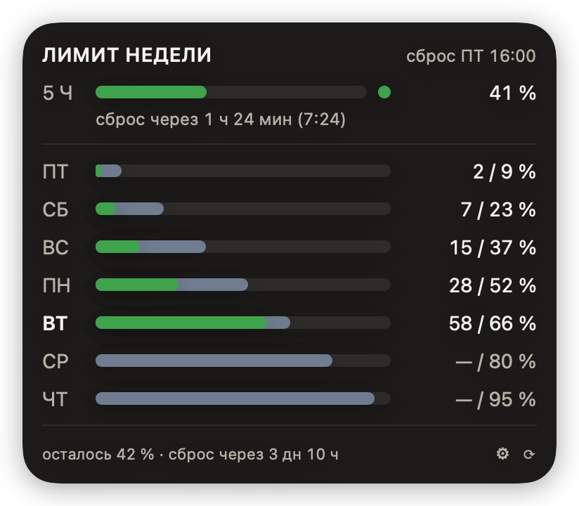
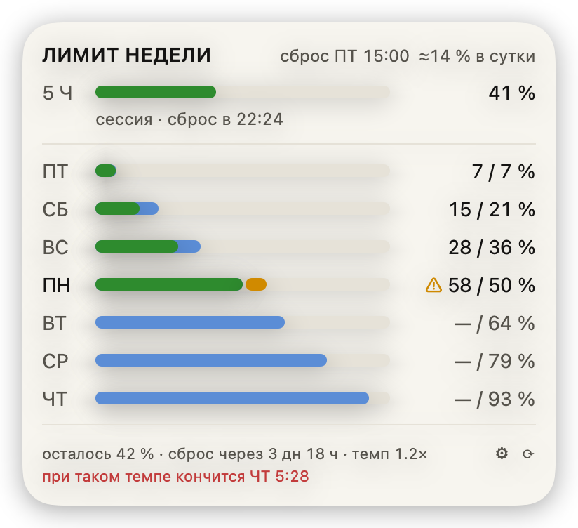
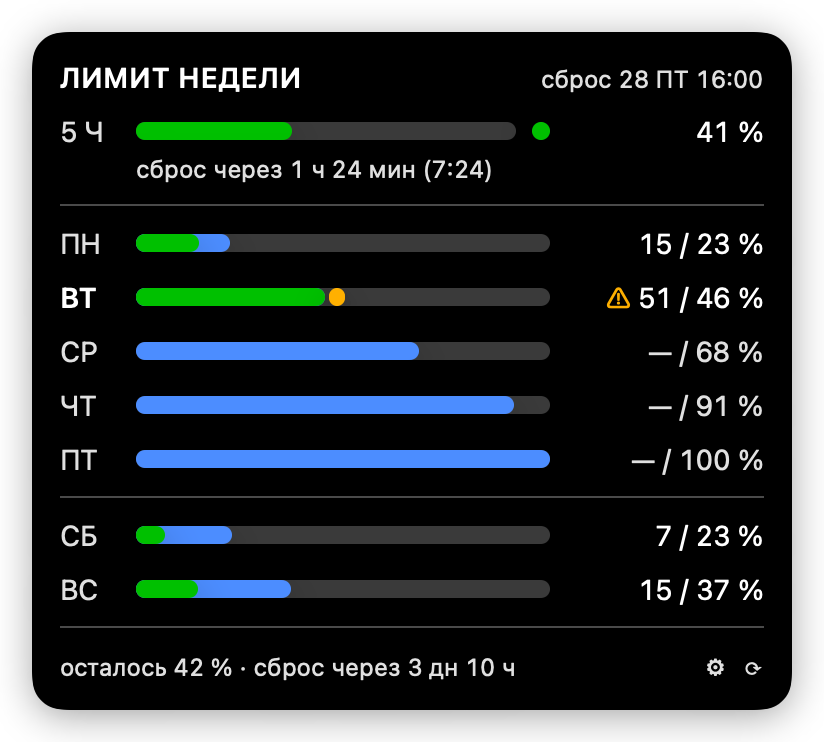
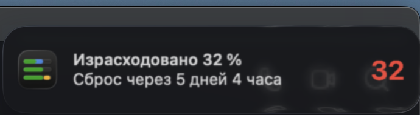

# ClaudeWeek — подробное руководство

Всё, что не поместилось в [README](../README.md): доступ к токену, устройство
панели, расчёт плана, каждая настройка и каждый ключ конфига, флаги командной
строки и объяснения, почему сделано именно так.

## Оглавление

- [Авторизация и доступ](#авторизация-и-доступ)
- [Калибровка](#калибровка)
- [Панель](#панель)
- [Как считается план](#как-считается-план)
- [Темы](#темы)
- [Настройки](#настройки)
- [Уведомления](#уведомления)
- [Обновление](#обновление)
- [Файл конфигурации](#файл-конфигурации)
- [Откуда берутся цифры](#откуда-берутся-цифры)
- [Командная строка](#командная-строка)
- [Почему так сделано](#почему-так-сделано)

---

## Авторизация и доступ

Ничего вводить не нужно: приложение берёт OAuth-токен уже авторизованного
Claude Code из Keychain (запись `Claude Code-credentials`) и потому видит ровно
тот аккаунт, что показывает `/usage`. Ни API-ключа, ни отдельного входа,
ни строки в конфиге — токену не место в файле на диске.

Что происходит с этой записью:

- **только чтение.** Токен обновляет сам Claude Code; ClaudeWeek в неё не
  пишет никогда — два процесса, наперегонки правящие одну запись, теряют токен.
- **разрешение спрашивает macOS.** При первом запуске всплывает системный
  диалог доступа к записи, и его можно отклонить. Что нужно, чтобы вопрос не
  возвращался каждый день, — ниже.
- **токен никуда не уходит.** Не пишется на диск, не попадает в лог, не
  показывается в интерфейсе. Единственный сетевой адресат — `api.anthropic.com`;
  в кеш ложатся проценты, границы окна и метка времени.
- **всё это проверяется глазами** — `Keychain.swift` и `OfficialProvider.swift`,
  и собираете вы из исходников сами.

**Вставить свой токен нельзя.** Эндпоинт `/api/oauth/usage` принимает только
токен сеанса Claude Code: проверено 2026-08-05 — годовой токен от
`claude setup-token` он отвергает с `401 Invalid bearer token`, API-ключ
(`sk-ant-api…`) тоже. Своего окна авторизации у ClaudeWeek нет и не будет:
`client_id` сторонним программам Anthropic не выдаёт, а ходить с чужим значило
бы показывать человеку в окне согласия чужое имя. Подробности — в
[API.md](API.md#токен).

**Можно и вовсе без токена.** `provider: local` (в настройках — «Только
локальная оценка») к Keychain не обращается совсем: расход считается по вашим же
транскриптам в `~/.claude/projects`. Цена отказа — знак `≈` перед процентом.

### Чтобы разрешение спросили один раз

Разрешение macOS привязывает не к приложению как файлу, а к его *designated
requirement* — правилу, по которому система узнаёт «то самое» приложение.
У ad-hoc подписи (`codesign --sign -`) это правило звучит как «ровно вот этот
хеш бинаря»:

```
# designated => cdhash H"c86938354fee1e4e2448b30a93c957a5389dc4c3"
```

Любая пересборка меняет хеш, разрешение перестаёт к чему-либо относиться —
и диалог возвращается. Лечится один раз, постоянным сертификатом:

```bash
./scripts/signing-cert.sh   # завести сертификат (спросит пароль от связки ключей)
./scripts/install.sh        # переустановить — бандл подпишется им
```

Requirement становится таким — и остаётся одинаковым у всех будущих сборок:

```
# designated => identifier "com.greem4.claudeweek" and certificate leaf H"…"
```

Дальше приложение остаётся в списке доверенных навсегда, включая обновления
через кнопку в «О программе» (новый бандл переподписывается тем же
сертификатом, `UpdateInstaller.resign`).

### Почему одного сертификата не хватило

Список доверенных приложений — не единственная проверка. У каждой записи есть
ещё *partition list*, и в него приложение попадает не по сертификату, а по
`cdhash` конкретной сборки: `teamid:` выдаётся только сертификатом от Apple, а
самоподписанный его не даёт (`codesign -dv` покажет `TeamIdentifier=not set`).
Хуже того, этот список обнуляется при каждой перезаписи записи — а Claude Code
переписывает её на каждом обновлении токена, примерно раз в сутки. Отсюда и
брался ежедневный диалог: «Всегда разрешать» доживало ровно до следующего
обновления токена.

Смотреть так (секретов не печатает, только правила доступа):

```bash
security dump-keychain -a ~/Library/Keychains/login.keychain-db \
  | grep -A 40 'svce.*Claude Code-credentials'
# entry 1: applications (…): /Users/…/ClaudeWeek.app (OK)   ← сертификат, держится
# entry 3: partition_id  description: apple-tool:, cdhash:…  ← сбрасывается
```

Выход нашёлся в том же дампе: `/usr/bin/security` числится и в доверенных, и в
partition list (`apple-tool:`) — и остаётся там потому, что этой же утилитой
токен пишет сам Claude Code. Поэтому запись читается ею (`find-generic-password
-w`), а прямой запрос к Keychain остался запасным путём и вдобавок лишён права
показывать диалог (`kSecUseAuthenticationUIFail`): не пустили без вопроса —
панель молча уходит на локальную оценку, а не встаёт модальным окном посреди
чужой работы.

Сертификат самоподписанный: ни Apple ID, ни Developer ID для него не нужно, но
и Gatekeeper он не убеждает — карантин со скачанного образа по-прежнему
снимается руками. Его дело — стабильность requirement, и больше ничего.

**Сертификат — это и есть выданное разрешение.** Удалите его из связки ключей
(или переустановите систему без него) — следующая сборка снова будет спрашивать
про токен. Копия для другой машины и для CI снимается при создании:

```bash
./scripts/signing-cert.sh --export ~/claudeweek-signing.p12   # напечатает пароль
P12_PASSWORD=… ./scripts/signing-cert.sh --import ~/claudeweek-signing.p12
```

Что сейчас в связке — `./scripts/signing-cert.sh --show`; чем подписан
установленный бандл — `codesign -d -r- ~/Applications/ClaudeWeek.app`.

Релизные образы подписываются тем же способом, если в репозитории заданы
секреты `SIGNING_CERT_P12` (файл `.p12` в base64) и `SIGNING_CERT_PASSWORD`;
без них релиз собирается ad-hoc, как раньше.

## Калибровка

Руками ничего подбирать не нужно. На каждом успешном официальном ответе
приложение сверяет с ним локальный расчёт и запоминает, сколько условных
долларов приходится на 100 % лимита. Когда сеть пропадёт, офлайн-оценка
опирается на этот эталон и на настоящий момент сброса — а не на догадку из
конфига. Проверено: 52 % официальных и 52 % офлайн-оценки на тех же данных.

Подобранный бюджет лежит в `~/.config/claude-week/cache.json`; ваш `config.json`
приложение перезаписывает только когда вы сами меняете что-то в окне настроек.

Ручная калибровка осталась на случай, когда официального ответа не было ни
разу, — выполните `/usage` внутри Claude Code и передайте число:

```bash
~/Applications/ClaudeWeek.app/Contents/MacOS/ClaudeWeek --calibrate=64
```

Заданный так `weeklyBudget` в конфиге всегда важнее подобранного: его выбрал
человек.

## Панель

Панель открывается по левому клику: без стрелки-хвостика, верхней кромкой
вплотную к строке меню, на материале системного меню — то есть полупрозрачная,
с размытием того, что под ней. Появляется мгновенно, закрывается кликом мимо
или по Esc. Правый клик по иконке даёт обычное меню: «Обновить»,
«Настройки…», «О программе», «Выйти».

Панель приходит туда, где вы сейчас: на текущий рабочий стол и под ту строку
меню, в которой стоит значок, — на втором мониторе так же, как на основном.
Уходите на другой стол — панель закрывается, как это делает системное меню.
Полноэкранное окно ей не помеха: она рисуется поверх, а строку меню в этот
момент система прячет, и панель приклеивается к верхней кромке экрана.

Условные обозначения на полосе:

```
█ факт   ▓ перерасход   ▒ остаток плана   ░ вне плана
```

Текущие сутки подписаны полужирным — сутки считаются по зоне окна, той же, по
которой строится весь ряд. Одного цвета подписи на это не хватало: в ряду из
семи одинаковых сокращений сегодняшний день приходилось искать.

Строки суток — **календарные**: они меняются в местную полночь, а не в час
сброса. Само окно недели границам суток не подчиняется и начинается там, где
его открыл сервер: в 12:00 UTC пятницы — это 15:00 по Москве и 16:00 в UTC+4.
Поэтому крайние строки короче остальных: первая — вечер пятницы после сброса,
последняя — её же утро перед следующим. Обе подписаны «ПТ», а какие именно
часы за ними стоят, показывает подсказка при наведении.

Первой строкой — **пятичасовая сессия**: тот лимит, в который упираются
чаще, чем в недельный. Она стоит над разделителем, в одной сетке с сутками,
но по свою его сторону: это независимый лимит, а не восьмой день недели.
Плановой зоны у неё нет намеренно — пятичасовое окно не обязано расходоваться
равномерно, и синяя «сколько положено к этому часу» изображала бы темп,
которого у сессии по смыслу нет.

### Вся неделя или только сегодня

По умолчанию панель показывает весь ряд. В настройках, вкладка **Панель**,
его можно свернуть до текущих суток: остаются пятичасовая сессия и одна
дневная полоса, а заголовок с часом сброса и футер с итогом недели — на месте.
Панель выходит короче на шесть строк.

Неделя при этом не потеряна: **щёлкните по строке дня, и ряд раскроется
целиком** — до повторного клика или до закрытия панели. Следующий её показ
снова компактный: раскрытие — то, что вы делаете сейчас, а не настройка.

### Расход по моделям

**Щелчок по самим цифрам процента** — справа в строке дня или в строке
сессии — заменяет строки дней разбивкой по моделям: Opus, Sonnet, Haiku, от
дорогой к дешёвой. Полоса показывает долю модели в недельном расходе, число
справа — её же в процентах, со знаком `≈`. Заголовок меняется на «МОДЕЛИ»,
чтобы ряд не читался как недельный со странными подписями, а под строками
стоит подпись: **≈ примерный локальный подсчёт**.

**Щелчок по цифрам ещё раз возвращает неделю** — где нажали, там и вернули.
Отдельного окна нет: это тот же вид панели, а не второе место, где те же
проценты сказаны по-своему. Открытие панели заново тоже показывает неделю:
разбивка живёт один показ, как и раскрытие компактного ряда.

Что не поместилось в строку, говорит подсказка при наведении: доля в
недельном лимите (`≈42 %`), токены по видам — вход, выход, запись и чтение
кеша, — число ответов и условная стоимость. Оттуда же ответ на вопрос, почему
у Haiku миллионы токенов и три процента доли: чтение кеша вдесятеро дешевле
входа, и веса это учитывают.

В компактном виде клик по строке раскрывает неделю, а клик по цифрам в той же
строке показывает разбивку: действия разведены по местам, и попасть в цифры
мышью проще, чем промахнуться.

**Разбивка — оценка, и вот почему.** Официальный эндпоинт отдаёт один процент
на всю неделю и о моделях не говорит ничего (см. [API.md](API.md)): полей
`seven_day_opus` и `seven_day_sonnet` на тарифе Max приходит `null`, а токенов
и долларов там нет вовсе. Поэтому доли считаются по локальным транскриптам
`~/.claude/projects` и взвешиваются по ценам моделей — тем же способом, что и
офлайн-оценка недели. К этому и относятся знак `≈` у каждого числа и подпись
под строками: итог недели в футере остаётся точным числом сервера, а его дележ
между моделями — правдоподобным.

Отсюда же случай, когда вместо строк стоит «разбивки нет»: транскриптов за это
окно не нашлось — `~/.claude/projects` пуст или Claude Code писал в другой
каталог. Строка эта тоже нажимается и возвращает неделю.

## Как считается план

План раскладывает 100 % недельного лимита **по рабочим часам**, а не по
астрономическим. Рабочий день задаётся в настройках (по умолчанию 11:00 →
00:00); ночью линия плана стоит. Отсюда простое правило: **факт ниже плана —
идёте в графике, выше — сгорите раньше пятницы.**

Ряд для рабочего дня 11:00 → 00:00 и окна «ПТ 16:00 → ПТ 16:00» (московское
время — на час меньше). Всего в неделе 91 рабочий час:

| Строка | Часы в окне | Рабочих часов | Бюджет строки | План к её концу |
|---|---|---|---|---|
| ПТ (вечер) | 16:00 → 0:00 | 8 | 8,8 % | 8,8 % |
| СБ | сутки | 13 | 14,3 % | 23,1 % |
| ВС | сутки | 13 | 14,3 % | 37,4 % |
| ПН | сутки | 13 | 14,3 % | 51,6 % |
| ВТ | сутки | 13 | 14,3 % | 65,9 % |
| СР | сутки | 13 | 14,3 % | 80,2 % |
| ЧТ | сутки | 13 | 14,3 % | 94,5 % |
| ПТ (утро) | 0:00 → 16:00 | 5 | 5,5 % | 100 % |

Строк на панели при этом семь, а не восемь: **пятница занимает одну**. Сброс
режет её надвое, но это один день недели, и двумя строками с несопоставимыми
процентами он только путал. Показывается та половина, которая идёт сейчас:

- **пока неделя катится** — вечер пятницы после сброса: первая строка, 8,8 %;
- **с полуночи последних суток окна** — её утро перед следующим сбросом:
  строка уходит в конец ряда, за четверг с его 94,5 %, и доводит неделю до
  100 %;
- **в 16:00 (15:00 МСК) лимит сбрасывается**, окно становится новым, и пятница
  снова первая строка — уже с новыми 8,8 % на вечер.

Так ряд выглядит при «Начале недели» = **День сброса**. По умолчанию же он
идёт **с понедельника** — так, как неделя устроена у человека, а не у сервера,
— и живёт в своей шкале: **понедельник открывается нулём, пятница приходит к
100 %** в момент сброса.

| ПН | ВТ | СР | ЧТ | ПТ | ─ | СБ | ВС |
|---|---|---|---|---|---|---|---|
| 22,8 % | 45,6 % | 68,4 % | 91,2 % | 100 % | | 23,1 % | 37,4 % |

Пятнице здесь достаётся её утро: сброс стоит в конце этих суток. 100 % в этой
шкале — не весь недельный лимит, а **то, что осталось к утру понедельника**:
57 рабочих часов от его полуночи до сброса раскладывают остаток, а факт
считается от той же точки. Сожгли половину лимита за выходные — строки покажут,
как расходуется вторая половина, а не всю неделю разом.

Суббота с воскресеньем остаются **за скобкой, под чертой в конце ряда**, и
проценты у них недельные: они и правда съели свою долю лимита, и пересчитывать
её не на что. Итог недели в футере — тоже недельный: «осталось 42 %» отвечает
за весь лимит, а строки ПН → ПТ — за его остаток.

Порядок от момента не зависит: строки стоят на своих местах всю неделю,
меняется только подсвеченная.

Что из этого следует на практике:

- **98 % в пятницу к 14:00 — это ровно по плану**, а не перерасход: до сброса
  остаётся один рабочий час из 91. Остаток догорит сам.
- **Вечер пятницы после сброса — полноценные 8,8 %**, потому что все восемь
  часов до полуночи рабочие. Это больше, чем достаётся утру пятницы (5,5 %):
  там до сброса всего пять рабочих часов, с 11:00 до 16:00.
- **Полные сутки весят одинаково — 14,3 %**, сколько бы часов вы ни спали.
  Именно это и ломалось, пока план шёл по астрономическому времени: сон
  забирал около 40 % недельного бюджета и раздувал те строки, куда попадала
  ночь.
- **Утром вы начинаете там же, где закончили вечером.** Ночь линию не двигает,
  так что вечернее отставание за сон не отыгрывается — и вечерний перерасход
  за ночь не рассасывается тоже.
- **Работа в три ночи целиком идёт в перерасход.** Плана на этот час нет.
  Если так выходит регулярно — раздвиньте рабочий день в настройках.
- **Перерасход виден по расхождению полос**, а когда он ведёт к беде — второй
  строкой футера: «при таком темпе кончится ПТ 15:57». Момент ищется тоже по
  рабочим часам: обещать исчерпание в четыре утра, когда никто не работает,
  бессмысленно.

Пятичасовая сессия к этому расчёту отношения не имеет: она сбрасывается своим
чередом, и упереться в неё можно на любой неделе, даже нетронутой.

## Темы

Палитра выбирается в настройках, вкладка **Панель**. Роли цветов везде
одни и те же — меняются оттенки:

| Системная | Полночь | Графит |
|---|---|---|
|  |  |  |

| Бумага | Контраст | Светлая тема системы |
|---|---|---|
|  |  |  |

**Системная** — родная палитра: она прогнана через валидатор на разделимость
при дальтонизме и контраст к фону, и менять её цвета по вкусу нельзя (§5.2
плана). Остальные — игровая площадка: роли цветов те же, но валидатором они не
проверялись.

Все картинки в документации рисует сама программа:
`ClaudeWeek --screenshot docs/images` — панель во всех темах и обоих системных
оформлениях плюс обе иконки строки меню. Вид на них заводской, а не ваш: чужие
пороги и свёрнутый ряд в документации читались бы как поведение программы.

## Настройки

Окно открывается кнопкой ⚙ в панели или правым кликом по иконке →
«Настройки…». Изменения применяются сразу — «Сохранить» там нет: пока крутите
ползунок прозрачности, панель перерисовывается вместе с ним. Всё, что
меняется в окне, ложится в `~/.config/claude-week/config.json`, и наоборот —
правки файла руками подхватываются в течение минуты. Исключение одно —
автозапуск: он живёт launchd-агентом, а не строкой конфига.

Пока окно открыто, панель закреплена у строки меню: она не закрывается по
клику мимо и служит предпросмотром — с настоящим размытием, своими цифрами и в
своём размере. Окно настроек при первом открытии встаёт так, чтобы её не
накрыть. Уходите в другую программу — панель прячется вместе с приложением и
возвращается, когда вернётесь; закрыли окно настроек — панель снова ведёт себя
как обычно.

### Общие

| Настройка | Что делает |
|---|---|
| Язык | «Как в системе» (по умолчанию), «Русский» или «English»; применяется сразу, без перезапуска |
| Запускать при входе в систему | автозапуск: заводит или сносит launchd-агента |
| Источник данных | `auto` — официальный с падением на локальный, `official` — только сервер, `local` — только оценка по транскриптам |
| Обновлять раз в | интервал опроса, 1–30 минут (в сеть — не чаще раза в 60 с) |
| Начало недели | с какого дня идёт ряд суток на панели: «Понедельник» (по умолчанию) или «День сброса». Момент сброса это не двигает — его называет сервер; под настройкой показан тот, что придёт следующим |
| Таймзона | в какой зоне считать границы суток и в какой показывать момент сброса |
| Рабочий день | распорядок из списка («Рабочий день 10–18», «Длинный день 10–22», «Вечерний 11–24», «С утра до ночи 9–22», «Круглосуточно») или свои часы степперами; по ним раскладывается недельный лимит, ночью план стоит. Строка «Получается» показывает выбранное словами: «11:00 – полуночи, 13 ч в сутки» |

«Как в системе» означает русский на русской macOS и английский на любой
другой: язык берётся из первого в списке предпочитаемых языков системы, и всё,
что не начинается с `ru`, считается английским. Явный выбор перекрывает
систему — английская macOS с русской программой и наоборот. Язык меняет только
интерфейс: недельное окно, порядок дней и расчёты от него не зависят, а
лог-файл остаётся русским в любом случае.

Галочка «Запускать при входе в систему» — единственная в окне, что не пишется
в `config.json`: она правит того же launchd-агента, что ставит `install.sh`, —
файл `~/Library/LaunchAgents/com.greem4.claudeweek.plist`. Включение и
выключение начинают действовать со следующего входа в систему: запущенное
приложение галочка не гасит и второй копии не поднимает. У отладочного
`swift run` она неактивна — автозапускать там нечего.

### Строка меню

| Настройка | Что делает |
|---|---|
| Значок | полоса с процентом, только полоса или кольцо с двумя лимитами |
| Заполнять дугой | только для кольца: что показывает дуга — пятичасовую сессию (по умолчанию) или недельный лимит. Второй лимит достаётся цифре в центре |
| Менять цвет по порогам | выключенный — значок всегда нейтрального цвета, расход виден заполнением и цифрой; панель красится в любом случае |
| Недельный лимит | после скольких процентов желтеет и краснеет (по умолчанию 81 и 93) |
| Пятичасовая сессия | то же для сессии — свои пороги, независимые от недельных (по умолчанию 81 и 95) |

У дуги и цифры в кольце цвета раздельные: каждая горит по порогам своего
лимита. Красная дуга при спокойной цифре — это не сбой, а сессия на исходе
при живой ещё неделе.

Цвет считается по факту: сколько потрачено прямо сейчас. План и прогноз на
него не влияют — они отвечают на вопрос «в графике ли я», а цвет на «пора ли
беспокоиться». Порог срабатывает включительно: 81 % загораются ровно на 81.
Красный у недели ниже сессионного (93 против 95) намеренно: сессия сбросится
сама через пять часов, а недельный лимит — только в день сброса, и запас там
кончается всерьёз.

Те же пороги красят заголовок панели (недельные) и полосу пятичасовой сессии
(сессионные). Суточные полосы им не подчиняются: они желтеют на любом
перерасходе относительно плана — это сам график, а не тревога.

Сессию сообщает только официальный источник. На локальной оценке её нет, и её
процент стоит на нуле: вторым лимитом он не подменяется — значок, означающий
то одно то другое, читать невозможно.

### Панель

| Настройка | Что делает |
|---|---|
| Палитра | системная, полночь, графит, бумага, контраст |
| Прозрачный фон | материал системного меню с размытием либо сплошная заливка палитры |
| Плотность фона | 0 — чистый материал, как у системных меню; 1 — плотная вуаль, сквозь которую размытие ещё видно |
| Скругление углов | 0–24 pt |
| Суточные полосы | «Вся неделя» — семь строк; «Только сегодня» — одна, а неделя раскрывается кликом по ней, пока панель открыта |
| Пятичасовая сессия | показывать ли строку сессии |
| Прогноз | вторая строка футера «при таком темпе кончится …» |
| Сброс сессии | «через 1 ч 12 мин», «в 14:35» или и то, и другое |

Отдельного предпросмотра на вкладке нет: всё это видно на самой панели, пока
открыто окно настроек. Исключение — подпись сброса сессии: без данных от
сервера строки сессии в панели нет вовсе, поэтому рядом с переключателем
стоит образец.

Сам момент сброса настройкой не двигается: его сообщает сервер вместе с
процентом, а выбирается только то, каким концом его показать. Час, попавший
на следующие сутки, подписывается днём недели — «в СР 2:15».

### Уведомления

| Настройка | Что делает |
|---|---|
| Предупреждать о приближении к лимиту | общий выключатель: гасит баннеры обоих лимитов, не трогая их пороги |
| Со звуком | звук вместе с баннером; выключенный — уведомление приходит молча и ждёт в Центре уведомлений |
| Показать пример | своя кнопка в каждой секции лимита: шлёт такой же баннер, как настоящий, с первым порогом этого лимита вместо живого расхода. На историю сказанного не влияет |
| Недельный лимит | уведомлять ли о неделе и после скольких процентов — два порога, по умолчанию 80 и 95. В баннере подписан «Неделя с …» |
| Пятичасовая сессия | то же для сессии, по умолчанию 75 и 95. В баннере подписан «Сессия с …» |

Пороги здесь свои, отдельные от цветовых со вкладки «Строка меню», и это не
дублирование: цвет замечают, только посмотрев на часы, а баннер приходит
поверх работы — отметка, на которой человек готов отвлечься, обычно выше той,
на которой значку пора пожелтеть.

Сессия предупреждает раньше недели (75 против 80) намеренно: пятичасовое окно
кончается быстро и незаметно, а его сброса ждать всего несколько часов —
тогда как неделя не сбросится до дня сброса, и там важнее второй, поздний
порог. Второй порог не опускается ниже первого: ползунки двигают друг друга.

### Доступ

Настроек здесь нет — только объяснение, откуда берётся токен, почему вставить
свой нельзя и как обойтись без него вовсе, плюс кнопка «Проверить сейчас»: она
делает один настоящий запрос и печатает результат — процент или причину отказа.

### О программе

Версия — и рядом с ней ссылка «журнал изменений»: она открывает
[CHANGELOG.md](../CHANGELOG.md) на GitHub, где записано, чем каждая версия
отличалась от прошлой. Ссылка ведёт на `main`, а не на тег установленной
сборки: так видно и то, что вышло уже после неё. Дальше бюджет недели (с
пометкой, задан он вами или подобран программой), ручная калибровка,
[обновление](#обновление) — состояние и единственная кнопка «Проверить
обновления», — пути к конфигу, кешу и логу с кнопками «Открыть», а также
«Сбросить настройки» — с подтверждением, и сброс не трогает подобранный бюджет
и калибровку: их программа набрала по живым данным.

## Уведомления

Баннер macOS приходит, когда расход перешагнул заданный порог. В нём две
строки и картинка:

```
Израсходовано 84 %
Сброс через 2 дня 4 часа
Неделя с СБ · больше всего Opus 62 %
```

Первая строка говорит, сколько уже потрачено (оценка помечается знаком `≈`,
как и в панели), вторая — сколько ждать сброса, третья — статистику окна: с
какого дня оно идёт и на какую модель ушло больше всего. У пятичасовой сессии
опора не день, а час начала: «Сессия с 17:30».

Ту же сводку показывает картинка, и в развёрнутом уведомлении её видно
целиком — подпись окна, процент, полоса расхода и главная модель под ней.

Разбивка считается за то окно, о котором речь: недельная берётся из снимка, а
для сессии её досчитывают по транскриптам ровно за эти пять часов. Если за
окно не нашлось ни одной записи — строки про модель не будет: выдумывать её
не из чего.

<p align="center">
  
  <br>
  
</p>

Цвет картинки берётся по порогам самих уведомлений, а не по цветовым со вкладки
«Строка меню»: между первым и вторым порогом жёлтый, от второго и выше —
красный. Иначе выходила бы нелепость — баннер о том, что расход перешагнул вашу
отметку, приходил бы со спокойным зелёным числом, потому что до порога окраски
значка не хватило процента.

Часа на циферблате в тексте нет намеренно: «через 2 дня 4 часа» и «в пятницу в
16:00» — одно и то же, сказанное дважды, а вторая половина ещё и переносит
строку. Точный момент сброса стоит в панели, где на него смотрят осознанно.
Порога в тексте нет по той же причине: его вы сами и задали. Исчерпанный лимит
говорит об этом прямо — «Лимит исчерпан».

Три правила, чтобы виджет не стал источником шума:

1. **об одном пороге — один раз за окно лимита.** Окно недели берётся из
   ответа сервера, окно сессии — из её `resetsAt`; сменилось окно — отсчёт
   начинается заново, и те же 80 % следующей недели прозвучат снова;
2. **только на ухудшении.** Расход, откатившийся назад (сервер пересчитал
   неделю, сменился источник), молчит: пройденный порог остаётся пройденным;
3. **остывание пять минут.** Два баннера подряд не приходят ближе; отложенный
   повод не теряется — он придёт следующим обновлением.

Сказанное лежит в `~/.config/claude-week/alerts.json` — рядом с кешем, но
отдельно от него: кеш перезаписывается каждым обновлением, а эта запись должна
пережить и его, и перезапуск программы. Удалить файл безопасно: худшее, что
случится, — одно повторное уведомление о пороге, который уже проходили.

Про разрешение macOS:

- спрашивается один раз, при первом запуске с включёнными уведомлениями;
- отказали — на вкладке появится кнопка «Открыть настройки уведомлений macOS»:
  снять запрет можно только там, программа второй раз не спросит;
- у отладочного `swift run` уведомлений нет вовсе: macOS опознаёт программу по
  бандлу, которого там нет. Кнопки «Показать пример» в этом случае неактивны.

Пятичасовая сессия уведомляет только при живом официальном источнике: локальная
оценка её процент не считает вовсе. Истёкшая сессия молчит — по числу из кеша,
от которого после сброса ничего не осталось, будить незачем.

## Обновление

Программа сама спрашивает GitHub, не вышел ли новый выпуск: через пять секунд
после запуска, раз в сутки и при пробуждении Mac, если сутки прошли во сне.
Один GET к `api.github.com`, без токена и без учёта того, кто спросил.

Скачивания и подмены сама не делает — только показывает строку внизу панели:
`↑ вышла версия 0.1.4 · в настройках →`. Щелчок по ней открывает настройки.
Программа в строке меню не должна перезапускаться посреди работы без спроса.

Всё управление — одной кнопкой на вкладке **«О программе»**; второго места,
где то же самое делается другими словами, нет. Кнопка называет свой следующий
шаг: «Проверить обновления» → «Обновить до 0.1.4…» → «Перезапустить».

По нажатию, когда версия найдена, появляется обычное окно macOS с началом
заметок к релизу и тремя ответами: «Обновить», «Что нового» (откроет страницу
релиза) и «Отмена». Согласились — дальше:

1. качается `ClaudeWeek-X.Y.Z-arm64.dmg` со страницы релиза;
2. считается SHA256 и сверяется с `SHA256SUMS.txt` того же релиза — сборка
   подписана ad-hoc, без Developer ID, и сумма остаётся единственным
   доказательством, что скачалось выложенное;
3. образ монтируется, с бандла снимается карантин, проверяются подпись и
   версия внутри — она обязана совпасть с обещанной релизом;
4. бандл заменяет работающий одним движением: либо на месте старая версия,
   либо целиком новая;
5. окно спрашивает: «Перезапустить» или «Позже».

До перезапуска в строке меню живёт прежняя версия. Конфиг, кеш, калибровка и
launchd-агент не трогаются.

Окнами разговаривает только нажатая кнопка. Самостоятельная проверка молчит:
нашла — строка в панели, не дозвонилась до GitHub — запись в лог, и ничего
поверх работы.

Ограничения:

- обновляется только собранный бандл; у отладочного `swift run` подменять
  нечего, и кнопка недоступна;
- образы выпускаются только под Apple Silicon. На Intel обновление честно
  скажет, что образа под `x86_64` нет, — там сборка из исходников
  (`./scripts/install.sh`);
- если приложение лежит в `/Applications` и прав на запись нет, программа
  скажет об этом вместо того, чтобы молча ничего не сделать.

То же самое из терминала — `ClaudeWeek --update`: проверяет, ставит и оставляет
перезапуск на вас. Удобно, когда приложение поднимает launchd: поставили и
вышли из системы.

## Файл конфигурации

`~/.config/claude-week/config.json` — читается при старте и после правки
(проверка раз в минуту по отпечатку файла):

| Ключ | По умолчанию | Смысл |
|---|---|---|
| `weekStart` | `monday` | с какого дня ряд суток на панели: `monday` или `reset` (день сброса). На цифры не влияет — только порядок строк |
| `resetWeekday` / `resetHour` / `resetMinute` | `6` / `16` / `0` | запасной момент сброса — пятница 16:00 в `timeZone` ниже, то есть 15:00 МСК. В настройках этих полей нет: они идут в дело, только если сервер не отвечал ещё ни разу и кеш пуст |
| `timeZone` | `""` | таймзона окна, границ суток и подписи сброса; пустая строка — системная |
| `refreshInterval` | `300` | секунды между обновлениями, минимум 30 |
| `provider` | `auto` | `official`, `local` или `auto` |
| `workHours.start` / `.end` | `11` / `24` | рабочий день, по которому раскладывается лимит; `24` — полночь. `0`/`24` — считать круглосуточно, как раньше |
| `menuBarStyle` | `ring` | `percent`, `compact` (только полоска) или `ring` (кольцо с процентом) |
| `ringArc` | `session` | что заполняет дугу кольца: `session` или `week`; второй лимит уходит на цифру внутри |
| `weeklyBudget` | `0` | условная стоимость недели для офлайн-оценки; ставится калибровкой |
| `thresholds.weekWarn` / `.weekCritical` | `81` / `93` | проценты недельного лимита, после которых цифра желтеет и краснеет |
| `thresholds.sessionWarn` / `.sessionCritical` | `81` / `95` | то же для пятичасовой сессии — кольцо в строке меню и полоса в панели |
| `thresholds.colorizeMenuBar` | `true` | красить ли значок в строке меню по порогам |
| `notifications.enabled` | `true` | показывать ли баннеры вообще |
| `notifications.sound` | `true` | со звуком или молча |
| `notifications.week.enabled` | `true` | уведомлять ли о недельном лимите |
| `notifications.week.first` / `.second` | `80` / `95` | проценты недели, на которых приходит баннер |
| `notifications.session.enabled` | `true` | уведомлять ли о пятичасовой сессии |
| `notifications.session.first` / `.second` | `75` / `95` | то же для сессии |
| `appearance.theme` | `contrast` | `system`, `midnight`, `graphite`, `paper`, `contrast` |
| `appearance.transparentPanel` | `true` | материал с размытием или сплошной фон |
| `appearance.panelTintOpacity` | `0.6` | плотность вуали поверх материала, 0…1 |
| `appearance.cornerRadius` | `16` | скругление углов панели, pt |
| `appearance.panelLayout` | `compact` | `week` — семь суточных полос, `compact` — только текущие сутки (неделя раскрывается кликом по строке дня) |
| `appearance.showSession` / `.showForecast` | `true` / `false` | показывать строку сессии и прогноз |
| `appearance.sessionReset` | `both` | подпись сброса сессии: `relative` («через 1 ч 12 мин»), `absolute` («в 14:35») или `both` |

Незнакомые и пропущенные ключи не ломают запуск: недостающее берётся из
дефолтов, а недопустимые значения чинятся с предупреждением в лог. Ключи от
прошлых версий (например, `planAnchor` — настройка «План считать на», или
`appearance.showSessionLabel` — слово «сессия» в подписи, которых больше нет)
просто игнорируются.

## Откуда берутся цифры

- **Официальный источник** — тот же процент, что в `/usage`: `GET
  /api/oauth/usage` с токеном из Keychain. Момент сброса недели тоже берётся
  из ответа, а не из конфига. Схема и дисциплина запросов — в [API.md](API.md).
- **Локальный источник** — запасной, работает офлайн: расход считается по
  `~/.claude/projects/**/*.jsonl`, токены взвешиваются по ценам моделей, записи
  из `subagents/` дедуплицируются по `uuid`, файлы читаются инкрементально
  (полный проход 193 файлов — 1.3 с, повторный — 0.04 с). Калибруется сам по
  официальному ответу, так что переход на него не роняет точность.

### Точное и приблизительное

Официальный ответ содержит одно число на всю неделю — разбивки по суткам в нём
нет. Поэтому итог сверху точный, а форму полос приложение восстанавливает по
локальным транскриптам и масштабирует к официальному числу.

Откуда взяты цифры, говорит **кружок рядом с полосой сессии** — а когда строки
сессии нет, он переезжает в заголовок, к часу сброса:

| Кружок | Подпись | Что значит |
|---|---|---|
| зелёный, залитый | данные online | свежий ответ сервера — то же число, что в `/usage` |
| жёлтый, залитый | данные offline | цифры сервера, но из кеша: сеть или авторизация отвалились |
| красный, контурный | данные offline | локальная оценка по транскриптам |
| красный, контурный | данные недоступны | показывать нечего — отказ без кеша |
| серый, контурный | данные загружаются | первый запуск, ответ ещё в пути |

Форма дублирует цвет намеренно: зелёный с красным при дейтеранопии почти
сливаются, а «залито или пусто» видно всегда. Наведите на кружок — и панель
скажет то же словами, тем же цветом. Больше в подписи ничего нет: почему
именно сервер не ответил — строчка лога, а не панели.

Ждать подсказку не обязательно: **нажмите на кружок**, и тот же текст встанет
прямо в панели — на месте полосы сессии, а когда кружок в заголовке, на месте
часа сброса. Через несколько секунд строка вернётся к обычному виду; повторное
нажатие убирает текст сразу.

Когда официальный источник недоступен — нет сети, не авторизован Claude Code —
приложение молча переходит на локальную оценку и помечает цифру в строке меню
как приблизительную: `≈64%`.

### Свежесть

Данные бывают старыми, и кружок об этом говорит: если снимку больше двух минут,
он желтеет и подписывается «данные offline». Пожелтеть ему есть от чего — после
отказа сервера виджет держит паузу (1 → 2 → 4 → 8 → 15 минут) и всё это время
показывает последнее удачное число.

Держит, но не бесконечно: через 15 минут после последнего удачного ответа
старое число отбрасывается, и в режиме `auto` панель уходит на локальную оценку.
Оценка по сегодняшним транскриптам честнее позавчерашнего официального числа,
выданного за сегодняшнее.

### Что ещё умеет

- **Пятичасовая сессия** — отдельная полоса над сутками с часом сброса. Число
  официальное; локально оно не считается, поэтому офлайн показывается последнее
  известное — и только пока его пятичасовое окно не истекло. После сброса
  строка исчезает: показать вчерашние 95 % как сегодняшние хуже, чем не
  показать ничего.
- **Жизненный цикл** — обновление по таймеру, пауза на время сна, реакция на
  пробуждение и смену таймзоны, перечитывание конфига после правки.
- **Автозапуск** — LaunchAgent, приложение живёт только в строке меню
  (`LSUIElement`), без иконки в Dock.
- **Доступность** — разметка для VoiceOver (вживую ещё не прослушана),
  уважение к «Уменьшению движения», числа рядом с каждой полосой: цвет нигде
  не остаётся единственным носителем смысла.

## Командная строка

```
ClaudeWeek                 запустить приложение в строке меню
ClaudeWeek --json          состояние в JSON (дни, сессия, стоимость, темп)
ClaudeWeek --calibrate=N   подогнать оценку под официальные N %
ClaudeWeek --screenshot К  отрисовать панель во всех темах и иконку в PNG
ClaudeWeek --config=ПУТЬ   свой файл конфигурации
ClaudeWeek --provider=X    источник данных: official, local или auto
ClaudeWeek --lang=X        язык интерфейса: system, ru или en
ClaudeWeek --icon К        сгенерировать .iconset (вызывается из make-app.sh)
ClaudeWeek --update        поставить свежий выпуск с GitHub, если он вышел
ClaudeWeek --verbose       подробный лог в stderr
```

Незнакомый флаг, неизвестный источник у `--provider=` или не-число у
`--calibrate=` — это ошибка с кодом 2 и подсказкой, а не молчаливый запуск
иконки в строке меню.

## Почему так сделано

Момент сброса берётся из официального ответа (`resets_at`), а не из конфига:
сервер знает его точно, а `resetWeekday`/`resetHour` — всего лишь догадка,
которая нужна офлайн. Поэтому их и нет в настройках: поле, которое почти
никогда ни на что не влияет, читается как сломанное — его крутят, ждут, что
неделя сдвинется, и не понимают, почему ничего не меняется. Настройками
двигается только порядок строк («Начало недели»), а сам момент сброса —
серверный, и показан рядом с ней прямым текстом. План строки — накопительный, на конец её суток: факт
в строке тоже накопительный, и сравнивать его с планом на середину значило бы
всю неделю показывать перерасход там, где его нет.

План идёт по рабочим часам, а не по астрономическим. Круглосуточная линия
была первой и продержалась ровно до первого взгляда на края окна: вечеру
пятницы после сброса (8 часов, все рабочие) она давала 4,8 %, а её утру
(16 часов, из которых 11 — сон) вдвое больше. Никакая подпись этого не
объясняет — сон просто не должен весить столько же, сколько работа. Цена
решения названа в настройках прямым текстом: ночью план стоит, и работа в
три ночи целиком ложится в перерасход.

Строки панели — календарные сутки местной зоны, а не «сутки окна» от сброса до
сброса. Первый вариант был вторым: он давал ровно семь строк с ровным рядом
7/21/36/50/64/79/93, но подписывал днём недели интервал, который на две трети
состоял из следующего дня, — в среду до 16:00 подсвечивалась строка «ВТ».
Календарные сутки стоят одной лишней строки (сброс делит пятницу надвое) и
неровного ряда, зато строка «СР» горит в среду. Проценты в неровном ряду
считаются временем, а не номером строки, поэтому неполные сутки получают свою
долю честно, а ряд приходит ровно к 100 % в момент сброса.

Форма подачи — выпадающая панель из строки меню, как у Stats или iStat Menus.
Виджет Центра уведомлений рассматривался и отклонён: он требует App Groups, а та
доступна только по платной подписке Apple Developer Program, которую из РФ штатно
не оплатить. Речь именно о виджете — обычные баннеры App Groups не требуют и
работают (см. [Уведомления](#уведомления)). Разбор — в [приложении Б плана](PLAN.md).
